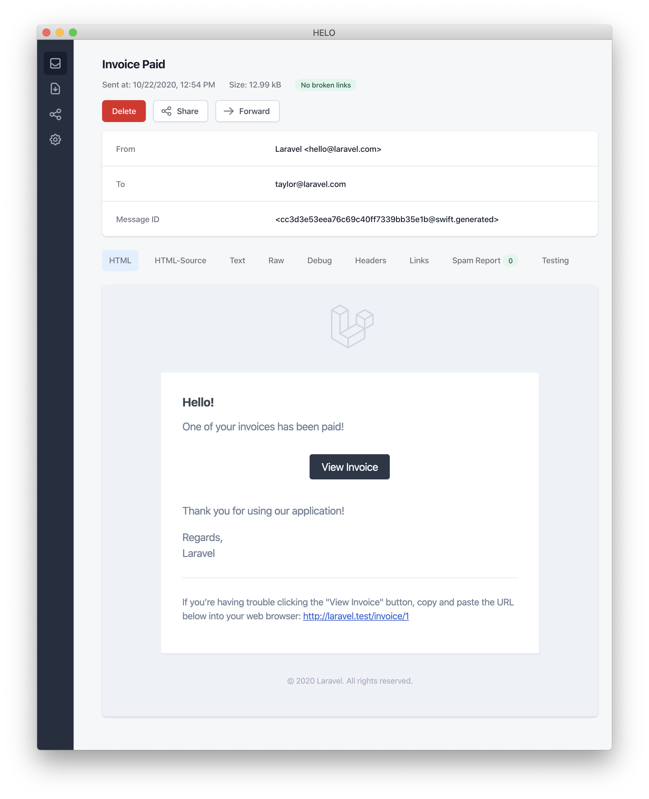

<br>


## Introduction

E-posta göndermeyi desteklemenin yanı sıra, Laravel çeşitli iletim kanalları (email, SMS (Vonage, eski adıyla Nexmo) ve Slack dahil) üzerinden bildirim göndermeyi de destekler. Ayrıca, topluluk tarafından oluşturulan birçok bildirim kanalı, onlarca farklı kanal üzerinden bildirim göndermek için mevcuttur! Bildirimler ayrıca bir veritabanında saklanabilir, böylece web arayüzünüzde görüntülenebilirler.

Genellikle bildirimler, uygulamanızda gerçekleşen bir olayı kullanıcılara bildiren kısa ve bilgilendirici mesajlardır. Örneğin, bir faturalandırma uygulaması yazıyorsanız, kullanıcılarınıza e-posta ve SMS kanalları aracılığıyla bir “Fatura Ödendi” bildirimi gönderebilirsiniz.

<br>


## Generating Notifications

Laravel’de her bildirim, genellikle `app/Notifications` dizininde saklanan tek bir sınıfla temsil edilir. Uygulamanızda bu dizin yoksa endişelenmeyin — `make:notification` Artisan komutunu çalıştırdığınızda sizin için oluşturulacaktır:

```bash
php artisan make:notification InvoicePaid
````

Bu komut, `app/Notifications` dizininize yeni bir bildirim sınıfı yerleştirir. Her bildirim sınıfı, hangi kanallar üzerinden iletileceğini belirleyen bir `via` metodu ve belirli bir kanal için mesajı biçimlendiren `toMail` veya `toDatabase` gibi çeşitli mesaj oluşturma metodları içerir.

<br>


## Sending Notifications

### Using the Notifiable Trait

Bildirimler iki şekilde gönderilebilir: `Notifiable` trait'inin `notify` metodu veya `Notification` facade'ı kullanılarak. `Notifiable` trait, varsayılan olarak uygulamanızın `App\Models\User` modelinde bulunur:

```php
<?php
 
namespace App\Models;
 
use Illuminate\Foundation\Auth\User as Authenticatable;
use Illuminate\Notifications\Notifiable;
 
class User extends Authenticatable
{
    use Notifiable;
}
```

`notify` metodu, bir bildirim örneği almayı bekler:

```php
use App\Notifications\InvoicePaid;
 
$user->notify(new InvoicePaid($invoice));
```

Unutmayın, `Notifiable` trait’i herhangi bir modelinize ekleyebilirsiniz; sadece `User` modeliyle sınırlı değildir.

<br>


### Using the Notification Facade

Alternatif olarak bildirimleri `Notification` facade’ı aracılığıyla da gönderebilirsiniz. Bu yöntem, birden fazla bildirilebilir varlığa (örneğin kullanıcı koleksiyonuna) bildirim göndermeniz gerektiğinde kullanışlıdır:

```php
use Illuminate\Support\Facades\Notification;
 
Notification::send($users, new InvoicePaid($invoice));
```

Bildirimleri hemen göndermek isterseniz `sendNow` metodunu kullanabilirsiniz. Bu metod, bildirim `ShouldQueue` arayüzünü uygularsa bile, bildirimi anında gönderir:

```php
Notification::sendNow($developers, new DeploymentCompleted($deployment));
```

<br>


## Specifying Delivery Channels

Her bildirim sınıfında, bildirimin hangi kanallardan gönderileceğini belirleyen bir `via` metodu bulunur. Bildirimler `mail`, `database`, `broadcast`, `vonage` ve `slack` kanallarıyla gönderilebilir.

Eğer `Telegram` veya `Pusher` gibi diğer kanalları kullanmak isterseniz, topluluk tarafından yönetilen **Laravel Notification Channels** sitesine göz atabilirsiniz.

`via` metodu, bildirimin gönderileceği sınıfın bir örneği olan `$notifiable` parametresini alır. Bildirimin hangi kanallardan gönderileceğini bu örnek üzerinden belirleyebilirsiniz:

```php
/**
 * Get the notification's delivery channels.
 *
 * @return array<int, string>
 */
public function via(object $notifiable): array
{
    return $notifiable->prefers_sms ? ['vonage'] : ['mail', 'database'];
}
```

<br>


## Queueing Notifications

Bildirimleri sıraya almadan önce kuyruğunuzu yapılandırmalı ve bir worker başlatmalısınız.

Bildirim göndermek zaman alabilir, özellikle kanal bildirimleri teslim etmek için harici bir API çağrısı yapıyorsa. Uygulamanızın yanıt süresini hızlandırmak için, bildirimlerinizi sıraya alabilirsiniz. Bunu yapmak için sınıfınıza `ShouldQueue` arayüzünü ve `Queueable` trait’ini ekleyin. Bu arayüz ve trait, `make:notification` komutuyla oluşturulan tüm bildirimlerde zaten eklenmiştir:

```php
<?php
 
namespace App\Notifications;
 
use Illuminate\Bus\Queueable;
use Illuminate\Contracts\Queue\ShouldQueue;
use Illuminate\Notifications\Notification;
 
class InvoicePaid extends Notification implements ShouldQueue
{
    use Queueable;
 
    // ...
}
```

Artık bildiriminizi normal şekilde gönderebilirsiniz. Laravel, sınıfta `ShouldQueue` arayüzünün varlığını algılar ve bildirimi otomatik olarak sıraya alır:

```php
$user->notify(new InvoicePaid($invoice));
```

Birden fazla alıcı ve kanal olduğunda, her alıcı/kanal kombinasyonu için ayrı bir iş (job) oluşturulur. Örneğin, üç alıcı ve iki kanal varsa altı job sıraya eklenir.

<br>


## Delaying Notifications

Bir bildirimin teslimini geciktirmek isterseniz, `delay` metodunu kullanabilirsiniz:

```php
$delay = now()->addMinutes(10);
 
$user->notify((new InvoicePaid($invoice))->delay($delay));
```

Belirli kanallar için farklı gecikme süreleri ayarlamak isterseniz, `delay` metoduna bir dizi (array) verebilirsiniz:

```php
$user->notify((new InvoicePaid($invoice))->delay([
    'mail' => now()->addMinutes(5),
    'sms' => now()->addMinutes(10),
]));
```

Alternatif olarak, bildirim sınıfına bir `withDelay` metodu tanımlayabilirsiniz:

```php
/**
 * Determine the notification's delivery delay.
 *
 * @return array<string, \Illuminate\Support\Carbon>
 */
public function withDelay(object $notifiable): array
{
    return [
        'mail' => now()->addMinutes(5),
        'sms' => now()->addMinutes(10),
    ];
}
```

<br>


## Customizing the Notification Queue Connection

Varsayılan olarak, sıraya alınan bildirimler uygulamanızın varsayılan queue bağlantısını kullanır. Belirli bir bildirim için farklı bir bağlantı belirtmek isterseniz, bildirimin constructor’ında `onConnection` metodunu çağırabilirsiniz:

```php
public function __construct()
{
    $this->onConnection('redis');
}
```

Her kanal için farklı queue bağlantısı belirtmek isterseniz `viaConnections` metodunu tanımlayabilirsiniz:

```php
public function viaConnections(): array
{
    return [
        'mail' => 'redis',
        'database' => 'sync',
    ];
}
```

<br>


## Customizing Notification Channel Queues

Her kanal için özel bir queue kullanmak isterseniz `viaQueues` metodunu tanımlayabilirsiniz:

```php
public function viaQueues(): array
{
    return [
        'mail' => 'mail-queue',
        'slack' => 'slack-queue',
    ];
}
```

<br>


## Customizing Queued Notification Job Properties

Sıraya alınan bildirimlerin temel job davranışını özelleştirmek için bildirim sınıfında özellikler tanımlayabilirsiniz:

```php
public $tries = 5;
public $timeout = 120;
public $maxExceptions = 3;
```

Veri gizliliğini ve bütünlüğünü korumak için `ShouldBeEncrypted` arayüzünü uygulayabilirsiniz.

Ayrıca `backoff` ve `retryUntil` metodlarını tanımlayarak yeniden deneme stratejilerini özelleştirebilirsiniz:

```php
public function backoff(): int
{
    return 3;
}

public function retryUntil(): DateTime
{
    return now()->addMinutes(5);
}
```

<br>


## Queued Notification Middleware

Sıraya alınan bildirimlerde, tıpkı queued job’larda olduğu gibi middleware kullanılabilir:

```php
use Illuminate\Queue\Middleware\RateLimited;

public function middleware(object $notifiable, string $channel)
{
    return match ($channel) {
        'mail' => [new RateLimited('postmark')],
        'slack' => [new RateLimited('slack')],
        default => [],
    };
}
```

<br>


## Queued Notifications and Database Transactions

Bildirimler bir veritabanı işlemi (transaction) içinde sıraya alınırsa, işlem commit edilmeden önce gönderilmeye çalışılabilir. Bu durumda, veri tutarsızlıkları yaşanabilir.

Bunu önlemek için, `afterCommit()` metodunu kullanabilirsiniz:

```php
$user->notify((new InvoicePaid($invoice))->afterCommit());
```

<br>


## Determining if a Queued Notification Should Be Sent

Bir queued notification’ın gönderilip gönderilmeyeceğini bildirim işleme sırasında kontrol etmek için `shouldSend` metodunu tanımlayabilirsiniz:

```php
public function shouldSend(object $notifiable, string $channel): bool
{
    return $this->invoice->isPaid();
}
```

<br>


## On-Demand Notifications

Uygulamanızda bir kullanıcı olarak kaydedilmemiş birine bildirim göndermek için `Notification::route` metodunu kullanabilirsiniz:

```php
Notification::route('mail', 'taylor@example.com')
    ->route('vonage', '5555555555')
    ->route('slack', '#slack-channel')
    ->route('broadcast', [new Channel('channel-name')])
    ->notify(new InvoicePaid($invoice));
```

<br>


## Mail Notifications

Bildirim bir e-posta olarak gönderilecekse, `toMail` metodunu tanımlamalısınız. Bu metod, bir `$notifiable` alır ve bir `Illuminate\Notifications\Messages\MailMessage` örneği döndürmelidir:

```php
public function toMail(object $notifiable): MailMessage
{
    $url = url('/invoice/'.$this->invoice->id);
 
    return (new MailMessage)
        ->greeting('Hello!')
        ->line('One of your invoices has been paid!')
        ->lineIf($this->amount > 0, "Amount paid: {$this->amount}")
        ->action('View Invoice', $url)
        ->line('Thank you for using our application!');
}
```

`MailMessage` sınıfı, işlemsel e-postaları kolayca biçimlendirmek için basit metodlar sağlar. `mail` kanalı, bu bileşenleri otomatik olarak güzel, duyarlı bir HTML e-posta şablonuna dönüştürür.





<br>


## Mail Notifications

E-posta bildirimleri gönderirken, `config/app.php` yapılandırma dosyanızda **name** yapılandırma seçeneğini ayarladığınızdan emin olun. Bu değer, e-posta bildiriminizin başlık ve altbilgi kısmında kullanılacaktır.

<br>


## Error Messages

Bazı bildirimler, kullanıcıları hatalardan haberdar eder (örneğin başarısız bir fatura ödemesi). Bir e-posta mesajının bir hatayla ilgili olduğunu belirtmek için mesajınızı oluştururken `error` metodunu çağırabilirsiniz. `error` metodu kullanıldığında, e-posta içindeki çağrı butonu siyah yerine kırmızı olacaktır:

```php
public function toMail(object $notifiable): MailMessage
{
    return (new MailMessage)
        ->error()
        ->subject('Invoice Payment Failed')
        ->line('...');
}
````

<br>


## Other Mail Notification Formatting Options

Bildirim sınıfında metin satırlarını (`line`) tanımlamak yerine, e-postayı oluşturmak için özel bir şablon belirtebilirsiniz. Bunun için `view` metodunu kullanın:

```php
public function toMail(object $notifiable): MailMessage
{
    return (new MailMessage)->view(
        'mail.invoice.paid', ['invoice' => $this->invoice]
    );
}
```

Dilerseniz e-postanın düz metin (plain-text) görünümünü ikinci parametre olarak bir diziye dahil edebilirsiniz:

```php
public function toMail(object $notifiable): MailMessage
{
    return (new MailMessage)->view(
        ['mail.invoice.paid', 'mail.invoice.paid-text'],
        ['invoice' => $this->invoice]
    );
}
```

Yalnızca düz metin görünümü varsa `text` metodunu kullanabilirsiniz:

```php
public function toMail(object $notifiable): MailMessage
{
    return (new MailMessage)->text(
        'mail.invoice.paid-text', ['invoice' => $this->invoice]
    );
}
```

<br>


## Customizing the Sender

Varsayılan olarak, e-posta gönderen adresi `config/mail.php` dosyasında tanımlanır. Ancak, belirli bir bildirim için gönderen adresini `from` metoduyla belirtebilirsiniz:

```php
public function toMail(object $notifiable): MailMessage
{
    return (new MailMessage)
        ->from('barrett@example.com', 'Barrett Blair')
        ->line('...');
}
```

<br>


## Customizing the Recipient

Laravel, e-posta kanalıyla bildirim gönderirken varsayılan olarak `email` özelliğini kullanır. Ancak, kullanılacak e-posta adresini özelleştirmek için `routeNotificationForMail` metodunu tanımlayabilirsiniz:

```php
public function routeNotificationForMail(Notification $notification): array|string
{
    // Sadece e-posta adresi döndür
    return $this->email_address;

    // E-posta adresi ve isim döndür
    return [$this->email_address => $this->name];
}
```

<br>


## Customizing the Subject

Varsayılan olarak, e-posta başlığı (subject), bildirim sınıfı adından türetilir. Örneğin `InvoicePaid` sınıfı için başlık “Invoice Paid” olur. Başlığı değiştirmek için `subject` metodunu kullanabilirsiniz:

```php
public function toMail(object $notifiable): MailMessage
{
    return (new MailMessage)
        ->subject('Notification Subject')
        ->line('...');
}
```

<br>


## Customizing the Mailer

Varsayılan olarak, bildirim e-postaları `config/mail.php` dosyasında belirtilen varsayılan mailer ile gönderilir. Fakat, çalışma anında farklı bir mailer belirtmek isterseniz `mailer` metodunu çağırabilirsiniz:

```php
public function toMail(object $notifiable): MailMessage
{
    return (new MailMessage)
        ->mailer('postmark')
        ->line('...');
}
```

<br>


## Customizing the Templates

Mail bildirimlerinin kullandığı HTML ve düz metin şablonlarını özelleştirmek için kaynakları yayınlayabilirsiniz:

```bash
php artisan vendor:publish --tag=laravel-notifications
```

Bu komuttan sonra şablonlar `resources/views/vendor/notifications` dizininde bulunacaktır.

<br>


## Attachments

Bir e-posta bildirimine dosya eklemek için `attach` metodunu kullanabilirsiniz:

```php
public function toMail(object $notifiable): MailMessage
{
    return (new MailMessage)
        ->greeting('Hello!')
        ->attach('/path/to/file');
}
```

Ayrıca eklenen dosyaya özel bir ad veya MIME türü verebilirsiniz:

```php
public function toMail(object $notifiable): MailMessage
{
    return (new MailMessage)
        ->attach('/path/to/file', [
            'as' => 'name.pdf',
            'mime' => 'application/pdf',
        ]);
}
```

`attachFromStorage` metodu, `MailMessage` içinde kullanılamaz. Bunun yerine dosyanın mutlak yolunu `attach` metoduyla belirtmelisiniz. Alternatif olarak bir `Mailable` döndürebilirsiniz:

```php
public function toMail(object $notifiable): Mailable
{
    return (new InvoicePaidMailable($this->invoice))
        ->to($notifiable->email)
        ->attachFromStorage('/path/to/file');
}
```

Birden fazla dosya eklemek için `attachMany` metodunu kullanabilirsiniz:

```php
public function toMail(object $notifiable): MailMessage
{
    return (new MailMessage)
        ->attachMany([
            '/path/to/forge.svg',
            '/path/to/vapor.svg' => [
                'as' => 'Logo.svg',
                'mime' => 'image/svg+xml',
            ],
        ]);
}
```

<br>


## Raw Data Attachments

Ham veri (örneğin PDF byte verisi) eklemek için `attachData` metodunu kullanabilirsiniz:

```php
public function toMail(object $notifiable): MailMessage
{
    return (new MailMessage)
        ->attachData($this->pdf, 'name.pdf', [
            'mime' => 'application/pdf',
        ]);
}
```

<br>


## Adding Tags and Metadata

Mailgun ve Postmark gibi bazı sağlayıcılar, e-posta mesajlarını gruplamak ve izlemek için “tags” ve “metadata” desteği sunar. Bunları `tag` ve `metadata` metodlarıyla ekleyebilirsiniz:

```php
public function toMail(object $notifiable): MailMessage
{
    return (new MailMessage)
        ->greeting('Comment Upvoted!')
        ->tag('upvote')
        ->metadata('comment_id', $this->comment->id);
}
```

Amazon SES kullanıyorsanız, “tags” eklemek için `metadata` metodunu kullanmalısınız.

<br>


## Customizing the Symfony Message

`MailMessage` sınıfının `withSymfonyMessage` metodu, mesaj gönderilmeden önce `Symfony Message` örneğiyle çalışmanıza olanak tanır. Bu sayede mesajı derinlemesine özelleştirebilirsiniz:

```php
use Symfony\Component\Mime\Email;

public function toMail(object $notifiable): MailMessage
{
    return (new MailMessage)
        ->withSymfonyMessage(function (Email $message) {
            $message->getHeaders()->addTextHeader(
                'Custom-Header', 'Header Value'
            );
        });
}
```

<br>


## Using Mailables

Gerekirse, `toMail` metodundan doğrudan bir `Mailable` nesnesi döndürebilirsiniz. Bu durumda alıcıyı `to` metoduyla belirtmelisiniz:

```php
public function toMail(object $notifiable): Mailable
{
    return (new InvoicePaidMailable($this->invoice))
        ->to($notifiable->email);
}
```

<br>


## Mailables and On-Demand Notifications

Eğer bildirim **on-demand** (isteğe bağlı) olarak gönderiliyorsa, `$notifiable` nesnesi `AnonymousNotifiable` sınıfının bir örneği olur. Bu durumda alıcı e-posta adresini şu şekilde alabilirsiniz:

```php
$address = $notifiable instanceof AnonymousNotifiable
    ? $notifiable->routeNotificationFor('mail')
    : $notifiable->email;
```

<br>


## Previewing Mail Notifications

Bildirim şablonlarını tasarlarken, e-postayı tarayıcıda önizlemek için bir rota tanımlayabilirsiniz:

```php
Route::get('/notification', function () {
    $invoice = Invoice::find(1);
    return (new InvoicePaid($invoice))->toMail($invoice->user);
});
```

<br>


## Markdown Mail Notifications

Markdown e-posta bildirimleri, Laravel’in hazır şablonlarından yararlanarak daha uzun ve özelleştirilmiş mesajlar yazmanıza olanak tanır. Markdown ile yazıldıkları için, Laravel bu mesajları duyarlı HTML şablonlara dönüştürür ve ayrıca düz metin versiyonunu da oluşturur.

<br>


### Generating the Message

Markdown şablonlu bir bildirim oluşturmak için `--markdown` seçeneğini kullanabilirsiniz:

```bash
php artisan make:notification InvoicePaid --markdown=mail.invoice.paid
```

Bildirim sınıfında `toMail` metodu tanımlanır ve `markdown` metoduyla şablon belirtilir:

```php
public function toMail(object $notifiable): MailMessage
{
    $url = url('/invoice/'.$this->invoice->id);

    return (new MailMessage)
        ->subject('Invoice Paid')
        ->markdown('mail.invoice.paid', ['url' => $url]);
}
```

<br>


### Writing the Message

Markdown mail bildirimleri, Blade bileşenleriyle birlikte Markdown sözdizimini kullanır:

```blade
<x-mail::message>
# Invoice Paid

Your invoice has been paid!

<x-mail::button :url="$url">
View Invoice
</x-mail::button>

Thanks,<br>


{{ config('app.name') }}
</x-mail::message>
```

Markdown’da fazla girinti (indentation) kullanmayın; aksi takdirde içerik kod bloğu olarak işlenir.

<br>


### Button Component

`button` bileşeni ortalanmış bir bağlantı düğmesi oluşturur. `url` ve isteğe bağlı olarak `color` parametresini alır (`primary`, `green`, `red` desteklenir).

<br>


### Panel Component

`panel` bileşeni, içeriği farklı bir arka plan rengine sahip bir panel içinde gösterir:

```blade
<x-mail::panel>
This is the panel content.
</x-mail::panel>
```

<br>


### Table Component

`table` bileşeni, bir Markdown tablosunu HTML tablosuna dönüştürür:

```blade
<x-mail::table>
| Laravel       | Table         | Example       |
| ------------- | :-----------: | ------------: |
| Col 2 is      | Centered      | $10           |
| Col 3 is      | Right-Aligned | $20           |
</x-mail::table>
```

<br>


## Customizing the Components

Markdown bileşenlerini kendi uygulamanıza aktarmak için:

```bash
php artisan vendor:publish --tag=laravel-mail
```

Bu işlemden sonra bileşenler `resources/views/vendor/mail` dizinine kopyalanır.

<br>


## Customizing the CSS

CSS dosyaları `resources/views/vendor/mail/html/themes` dizininde bulunur. `default.css` dosyasını düzenleyerek stilinizi özelleştirebilirsiniz. İsterseniz tamamen yeni bir tema oluşturabilir ve `config/mail.php` içindeki `theme` ayarını buna göre değiştirebilirsiniz.

Bireysel bir bildirim için temayı değiştirmek isterseniz `theme` metodunu kullanabilirsiniz:

```php
public function toMail(object $notifiable): MailMessage
{
    return (new MailMessage)
        ->theme('invoice')
        ->subject('Invoice Paid')
        ->markdown('mail.invoice.paid', ['url' => $url]);
}
```

```
```


<br>


## Database Notifications

### Prerequisites

Veritabanı bildirim kanalı, bildirim bilgilerini bir veritabanı tablosunda saklar. Bu tablo, bildirim türü gibi bilgileri ve bildirimi tanımlayan bir JSON veri yapısını içerir.

Bu tabloyu sorgulayarak bildirimleri uygulamanızın kullanıcı arayüzünde görüntüleyebilirsiniz. Ancak bunu yapmadan önce, bildirimlerinizi tutacak bir tablo oluşturmanız gerekir. Gerekli tablo şemasına sahip migration dosyasını oluşturmak için aşağıdaki komutu çalıştırın:

```bash
php artisan make:notifications-table
 
php artisan migrate
````

Eğer `notifiable` modelleriniz **UUID** veya **ULID** birincil anahtarlar kullanıyorsa, migration dosyasındaki `morphs` metodunu `uuidMorphs` veya `ulidMorphs` ile değiştirmelisiniz.

<br>


### Formatting Database Notifications

Bir bildirim veritabanında saklanabiliyorsa, bildirim sınıfında `toDatabase` veya `toArray` metodunu tanımlamalısınız. Bu metod, `$notifiable` nesnesini alır ve bir PHP dizisi döndürmelidir. Dönen dizi JSON olarak kodlanır ve bildirim tablosundaki `data` sütununda saklanır:

```php
public function toArray(object $notifiable): array
{
    return [
        'invoice_id' => $this->invoice->id,
        'amount' => $this->invoice->amount,
    ];
}
```

Bildirim veritabanında saklandığında, `type` sütunu varsayılan olarak bildirimin sınıf adıyla doldurulur ve `read_at` sütunu `null` olur. Ancak bu davranışı özelleştirmek için `databaseType` ve `initialDatabaseReadAtValue` metodlarını tanımlayabilirsiniz:

```php
public function databaseType(object $notifiable): string
{
    return 'invoice-paid';
}
 
public function initialDatabaseReadAtValue(): ?Carbon
{
    return null;
}
```

<br>


### toDatabase vs. toArray

`toArray` metodu aynı zamanda `broadcast` kanalı tarafından da kullanılır. Eğer `database` ve `broadcast` kanalları için farklı veri yapıları istiyorsanız, `toArray` yerine `toDatabase` metodunu tanımlamalısınız.

<br>


### Accessing the Notifications

Bildirimler veritabanında saklandıktan sonra, bunlara erişmek için `Illuminate\Notifications\Notifiable` trait’inde bulunan `notifications` ilişkisini kullanabilirsiniz:

```php
$user = App\Models\User::find(1);
 
foreach ($user->notifications as $notification) {
    echo $notification->type;
}
```

Sadece **okunmamış** bildirimleri almak için `unreadNotifications` ilişkisini kullanabilirsiniz:

```php
foreach ($user->unreadNotifications as $notification) {
    echo $notification->type;
}
```

Sadece **okunmuş** bildirimleri almak için `readNotifications` ilişkisini kullanabilirsiniz:

```php
foreach ($user->readNotifications as $notification) {
    echo $notification->type;
}
```

JavaScript istemcinizden bildirimlere erişmek için, geçerli kullanıcı gibi bir `notifiable` varlığın bildirimlerini döndüren bir **controller** tanımlayın ve bu controller’ın URL’sine HTTP isteği gönderin.

<br>


### Marking Notifications as Read

Bir kullanıcı bildirimi görüntülediğinde, onu “okundu” olarak işaretlemek isteyebilirsiniz. `markAsRead` metodu `read_at` sütununu günceller:

```php
foreach ($user->unreadNotifications as $notification) {
    $notification->markAsRead();
}
```

Tüm bildirimleri toplu olarak işaretlemek için:

```php
$user->unreadNotifications->markAsRead();
```

Veya veritabanı sorgusuyla topluca güncellemek için:

```php
$user->unreadNotifications()->update(['read_at' => now()]);
```

Tüm bildirimleri tamamen silmek isterseniz:

```php
$user->notifications()->delete();
```

<br>


## Broadcast Notifications

### Prerequisites

Bildirimleri yayınlamadan önce, Laravel’in **event broadcasting** servisini yapılandırmış olmanız gerekir. Bu servis, sunucu tarafındaki olaylara JavaScript tabanlı istemcinizden tepki vermenizi sağlar.

<br>


### Formatting Broadcast Notifications

`broadcast` kanalı, Laravel’in yayın sistemi aracılığıyla bildirimleri yayınlar. Bildiriminiz yayınlanabiliyorsa, bildirim sınıfında bir `toBroadcast` metodu tanımlayın:

```php
public function toBroadcast(object $notifiable): BroadcastMessage
{
    return new BroadcastMessage([
        'invoice_id' => $this->invoice->id,
        'amount' => $this->invoice->amount,
    ]);
}
```

<br>


### Broadcast Queue Configuration

Tüm yayın bildirimleri kuyrukta işlenir. Kullanılacak **queue bağlantısını** veya **queue adını** özelleştirmek için `onConnection` ve `onQueue` metodlarını kullanabilirsiniz:

```php
return (new BroadcastMessage($data))
    ->onConnection('sqs')
    ->onQueue('broadcasts');
```

<br>


### Customizing the Notification Type

Yayınlanan bildirimler, bildirimin tam sınıf adını içeren bir `type` alanına sahiptir. Bu değeri özelleştirmek için `broadcastType` metodunu tanımlayabilirsiniz:

```php
public function broadcastType(): string
{
    return 'broadcast.message';
}
```

<br>


### Listening for Notifications

Bildirimler `{notifiable}.{id}` biçiminde özel bir kanalda yayınlanır. Örneğin, ID’si 1 olan bir kullanıcıya bildirim gönderiliyorsa, kanal adı `App.Models.User.1` olacaktır.

Laravel Echo ile bu kanalı şu şekilde dinleyebilirsiniz:

```javascript
Echo.private('App.Models.User.' + userId)
    .notification((notification) => {
        console.log(notification.type);
    });
```

<br>


### Using React or Vue

Laravel Echo, React ve Vue için bildirimleri dinlemeyi kolaylaştıran **hooks** içerir. `useEchoNotification` hook’unu kullanabilirsiniz:

```javascript
useEchoNotification(
    `App.Models.User.${userId}`,
    (notification) => {
        console.log(notification.type);
    },
);
```

Belirli türde bildirimleri dinlemek için türü veya tür listesini üçüncü parametre olarak geçebilirsiniz.

Ayrıca TypeScript ile tip güvenliği sağlamak için bildirim verisinin tipini belirtebilirsiniz.

<br>


### Customizing the Notification Channel

Bildirimlerin hangi kanaldan yayınlanacağını özelleştirmek için, `receivesBroadcastNotificationsOn` metodunu tanımlayın:

```php
public function receivesBroadcastNotificationsOn(): string
{
    return 'users.'.$this->id;
}
```

<br>


## SMS Notifications

### Prerequisites

Laravel’de SMS bildirimleri **Vonage** (eski adıyla Nexmo) tarafından desteklenir. Gerekli paketleri yükleyin:

```bash
composer require laravel/vonage-notification-channel guzzlehttp/guzzle
```

`.env` dosyanıza Vonage API anahtarlarınızı ekleyin:

```env
VONAGE_KEY=your-key
VONAGE_SECRET=your-secret
VONAGE_SMS_FROM=15556666666
```

<br>


### Formatting SMS Notifications

Bildirim sınıfında `toVonage` metodunu tanımlayın:

```php
public function toVonage(object $notifiable): VonageMessage
{
    return (new VonageMessage)
        ->content('Your SMS message content');
}
```

Unicode karakterler içeriyorsa:

```php
->unicode();
```

Gönderen numarasını değiştirmek isterseniz:

```php
->from('15554443333');
```

Müşteri referansı eklemek için:

```php
->clientReference((string) $notifiable->id);
```

<br>


### Routing SMS Notifications

SMS bildirimlerinin hangi numaraya gideceğini belirlemek için `routeNotificationForVonage` metodunu tanımlayın:

```php
public function routeNotificationForVonage(Notification $notification): string
{
    return $this->phone_number;
}
```

<br>


## Slack Notifications

### Prerequisites

Slack bildirimleri için gerekli paketi yükleyin:

```bash
composer require laravel/slack-notification-channel
```

Slack uygulamanızın **chat:write**, **chat:write.public**, ve **chat:write.customize** izinlerine sahip olduğundan emin olun.

`.env` veya `config/services.php` dosyanıza Bot token’ınızı ekleyin:

```php
'slack' => [
    'notifications' => [
        'bot_user_oauth_token' => env('SLACK_BOT_USER_OAUTH_TOKEN'),
        'channel' => env('SLACK_BOT_USER_DEFAULT_CHANNEL'),
    ],
],
```

<br>


### Formatting Slack Notifications

Slack mesajlarını `toSlack` metodunda oluşturabilirsiniz:

```php
public function toSlack(object $notifiable): SlackMessage
{
    return (new SlackMessage)
        ->text('One of your invoices has been paid!')
        ->headerBlock('Invoice Paid')
        ->sectionBlock(function (SectionBlock $block) {
            $block->text('An invoice has been paid.');
        });
}
```

`Block Kit Builder` üzerinden tasarım yapabilir ve `usingBlockKitTemplate` metoduyla ham JSON yükünü kullanabilirsiniz.

<br>


### Slack Interactivity

Slack butonları veya etkileşimli öğeler eklemek için `actionsBlock` metodunu kullanabilirsiniz:

```php
$block->button('Acknowledge Invoice')->primary();
$block->button('Deny')->danger()->id('deny_invoice');
```

Kullanıcıların işlemi onaylamasını istiyorsanız `confirm` metodunu ekleyin.

<br>


### Routing Slack Notifications

Bildirimleri belirli bir kanala yönlendirmek için:

```php
public function routeNotificationForSlack(Notification $notification): mixed
{
    return '#support-channel';
}
```

Dış Slack workspace’lerine bildirim göndermek için `SlackRoute::make($this->slack_channel, $this->slack_token)` kullanabilirsiniz.

<br>


## Localizing Notifications

Bildirimleri farklı bir dilde göndermek için `locale` metodunu kullanabilirsiniz:

```php
$user->notify((new InvoicePaid($invoice))->locale('es'));
```

Kullanıcının tercih ettiği dili otomatik kullanmak için modelinizde `HasLocalePreference` arayüzünü uygulayın.

<br>


## Testing

Bildirimleri test ederken göndermeyi engellemek için `Notification::fake()` metodunu kullanın:

```php
Notification::fake();
Notification::assertSentTo([$user], OrderShipped::class);
Notification::assertNotSentTo([$user], AnotherNotification::class);
Notification::assertSentTimes(WeeklyReminder::class, 2);
Notification::assertCount(3);
```

On-demand bildirimler için:

```php
Notification::assertSentOnDemand(OrderShipped::class);
```

<br>


## Notification Events

Laravel, bildirim gönderimi sırasında iki olay yayınlar:

* **NotificationSending** → Bildirim gönderilmeden önce
* **NotificationSent** → Bildirim gönderildikten sonra

Bu olaylara listener tanımlayarak bildirim akışını özelleştirebilirsiniz.

<br>


## Custom Channels

Kendi bildirim kanalınızı oluşturabilirsiniz. Örneğin `VoiceChannel` adlı bir sınıf tanımlayın ve `send` metodunu yazın:

```php
class VoiceChannel
{
    public function send(object $notifiable, Notification $notification): void
    {
        $message = $notification->toVoice($notifiable);
        // Bildirimi gönder...
    }
}
```

Bildirim sınıfında bu kanalı `via` metoduyla kullanın:

```php
public function via(object $notifiable): string
{
    return VoiceChannel::class;
}
```

Laravel, yazılım geliştirmenin, dağıtımının ve izlenmesinin en üretken yoludur.


